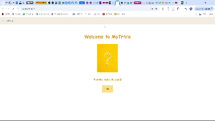

# Trivia Quiz App
Welcome to the MyTrivia App!
This project is a fun and interactive quiz game where users can answer trivia questions from various categories and test their knowledge.
The app provides an engaging experience with a timer, score tracking, and the ability to restart the game.

## Demo Video

Check out the demo of the MyTrivia App in this video:

[Watch the Demo Video](src/images/Demo_MyTrivia.mp4)

## Features

Multiple Categories: Choose from a variety of trivia categories.
Timer: You have 10 seconds to answer as much questions as you can, making the game more exciting and fast-paced.
Score Tracking: Keep track of your score as you answer questions.
Game Over Screen: View your score and restart the game after completing a round.

## Technologies Used

### Frontend:
React (for building the UI)
CSS (for styling)

### Backend:
[Open Trivia Database API](https://opentdb.com) for fetching trivia questions.

### Others:
React hooks for managing state and effects.
React.memo for performance optimization.
Axios for API requests.

## Setup
To run this project locally, follow these steps:
- Clone the Repository:
    git clone https://github.com/hadarbublil/trivia
- Install Dependencies:
    Navigate to the project folder and install dependencies:
    cd mytrivia-app
    npm install
- Run the App
    npm start

Your app will be available at http://localhost:3000.
